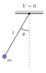

## Defination
Here is the **Euler-Lagrange's equation**:

$$
\frac{\mathrm{d}}{\mathrm{d}t}(\frac{\partial{\mathcal{L}}}{\partial{\dot{q_i}}})=\frac{\partial{\mathcal{L}}}{\partial{q_i}}
$$ {#eq-label}

Where $\mathcal{L}$ is the **Lagrangian**, defined as $T-V$. \
In **Mathematica**, we can compute it directly by calling the `VariationalMethods` package:

```
Needs["VariationalMethods`"]
L = T - V
EulerEquations[L, {q1[t], q2[t]}, t]
```

---

## Example

:::{.code-figure}
{width=20%}
```tex
\documentclass[tikz,border=5pt]{standalone}
\usetikzlibrary{patterns}
\usepackage{amsmath}

\begin{document}
\begin{tikzpicture}[>=stealth, thick]
    \def\angle{30}
    \def\len{3.5}

    \fill [pattern = north east lines] (-1,0) rectangle (1,0.2);
    \draw (-1,0) -- (1,0);
    
    \node[above] at (0,0.3) {$V = 0$};
    \fill (0,0) circle (2pt);

    \draw [dashed, gray] (0,0) -- (0,-4);
    
    \draw (0,0) -- ({-90-\angle}:\len) 
        node[midway, left, xshift=-2pt, yshift=5pt] {$l$};
    
    \node[circle, fill=blue!50, draw, inner sep=2.5pt] (ball) at ({-90-\angle}:\len) {};
    \node[below right=2pt] at (ball) {$m$};
    
    \draw (0,-1.2) arc (-90:{-90-\angle}:1.2);
    \node at ({-90-\angle/2}:1.5) {$\theta$};

\end{tikzpicture}
\end{document}
```
:::

Choose the angular displacement $\theta$ (the angle between the pendulum and the vertical) as the generalized coordinate.

$$
\mathcal{L} =\frac{1}{2}ml^2 \dot{\theta}^2+mgl\cos{\theta}
$$ {#eq-label}

Which set $V=0$ at the pivot point. Use Euler-Lagrange equation, we have:
$$
l\ddot{\theta}+g\sin{\theta}=0
$$ {#eq-label}

### Solution

$$
\dot{\theta}\ddot{\theta}+\frac{g}{l}\dot{\theta}\sin{\theta}=0 \\
$$ {#eq-label}

$$
\frac{\mathrm{d}}{\mathrm{d}t}(\frac{1}{2}\dot{\theta}^2-\frac{g}{l}\cos{\theta})=0
$$ {#eq-label}

Let $\theta=\theta_0$ when $t=0$ :
$$
\dot{\theta}^2=\frac{2g}{l}(\cos{\theta}-\cos{\theta_0})
$$ {#eq-label}

$$
t=\sqrt{\frac{l}{2g}} \int_0^{\theta} \frac{1}{\sqrt{\cos{\theta}-\cos{\theta_0}}}\mathrm{d}\theta
$$ {#eq-label}

Use double-angle formula $\cos{2x}=1-2\sin{x}^2$ and let $\sin{\frac{\theta}{2}}=k\sin{\phi}$ :
$$
t=\sqrt{\frac{l}{g}}\int_0^{\arcsin{\frac{1}{k}\sin{\frac{\theta}{2}}}}\frac{1}{\sqrt{1-k^2\sin{\phi}^2}} \mathrm{d}\phi 
$$ {#eq-label}

Where $k=\sin{\frac{\theta_0}{2}}$.
For the period $T$, the process is $\theta_0 \to 0 \to -\theta_0 \to 0$ , so:
$$
T=4\sqrt{\frac{l}{g}}\int_0^{\pi/2}\frac{1}{\sqrt{1-k^2\sin{\phi}^2}} \mathrm{d}\phi 
$$ {#eq-label}

This is [the Complete Elliptic Integral of the first Kind](https://en.wikipedia.org/wiki/Elliptic_integral#Complete_elliptic_integral_of_the_first_kind),  which can be written as:
$$
T=4\sqrt{\frac{l}{g}}K\left(\sin{\left( \frac{\theta_0}{2} \right)}\right)
$$ {#eq-label}

Using the power series expansion of $K(k)$ , we obtain:
$$
T=2\pi\sqrt{\frac{l}{g}}\sum_{n=0}^{\infty}\left( \frac{(2n)!}{2^{2n}(n!)} \right)^2 \sin^{2n}\left( \frac{\theta_0}{2} \right)
$$ {#eq-label}
