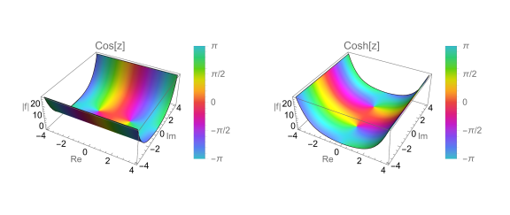
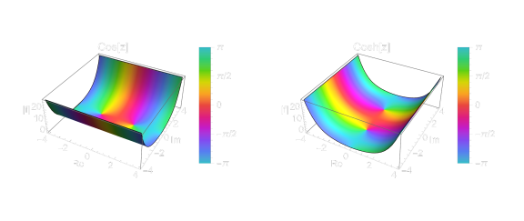

## 2026-02-16: Initial Building

### Technical Details

This blog is built by [Quarto](https://quarto.org), which is a powerful open-source scientific and technical publishing system built on Pandoc (written by AI in vscode). 

I choose **Quarto** for its support for $Tex$ formulas. My first choice was [Hexo](https://hexo.io). However, after spending an entire afternoon trying to configure it to support $Tex$ formulas--experimenting with renderers for $MathJax$, which failed to render formulas entirely, and $KaTex$, which produced ghosting arrtifacts and displayed raw $Tex$ code on the page--I ultimately decided to switch to **Quarto** on *7th Feb, 2026*.

The source code of this blog is available on [GitHub](https://github.com/Yijia-phys/my-blog). It was not my firstr time using **git**--I had previouly used it to upload my Obsidian vault to Github. But back then, I simply followed a tutorial posts machanically to set it up, and through an Obsidian plugin, I could have it automatically sync when closing Obsidian or after a certain time interval. I did not actually understand what those commands meant.

During the process of building this blog, I began to truly understand the meaning of Git commands, such as `git commit` and `git push`. More interestingly, following some advice, I wrote a simple `.ps1` script:
```powershell
quarto render
git add .
git commit -m "Update blog: $(Get-Date -Format 'yyyy-MM-dd HH:mm')"
git push origin main
```
While I have observed that many seasoned GitHub users opt for brief descriptive commit messages rather than only dates, I do not yet find this practice necessary for my own workflow. Firstly, the volume of my contributions remains modest, allowing me to roughly recall the content of each commit. More fundamentally, I have yet to encounter a scenario that would require me to revert to a previous state.

Before building this website, I had almost no knowledge of `CSS`. My `styles.css` file is probably full of messy, non-standard code. Since a large part of it was generated by AI, I don’t even have the ability to maintain it properly. Fortunately, at least for now, it seems to work just as I imagined. I hope to fill this knowledge gap in the days to come.

### Design Philosophy
Speaking of `CSS`, let me briefly explain the visual design of my website. I've kept the same color scheme across both dark and light modes—a *blue-purple navigation bar*, *white text*, and *yellow accents*. I'm not a fan of changing the theme colors when switching to dark mode, and this palette isn't too harsh on the eyes against a dark background either. I've also added some simple mobile adaptations—which, to be honest, have yielded barely acceptable results.

Also, the entire website is in English. My English isn't particularly strong—I scored a 6 on the IELTS writing section—so I'd like to use this space as a platform for practice. Some of the text you see here may have been translated with the help of AI, so if you notice any grammatical issues or have suggestions, feel free to [point them out](mailto:echo@yijialog.org).

Finally, a word on the purpose of this blog. I hope that one day it can find a place on my personal business card—something I can showcase when applying to schools or jobs in the future. That's why I don't plan to promote it widely or fill it with overly entertaining content. Of course, I know that those who become proficient do so through hands-on practice; to keep improving my blog, I need to let go of the "curse of perfectionism." I hope I can hold onto this mindset and continue refining this blog, step by step.

---
## 2026-03-21: Refactoring & New Features

### New Pages
I built a main site, which is now accessible at [yijialog.org](https://yijialog.org). It may come as a surprise to some that the main site was almost entirely generated by [Claude](https://claude.ai), and I have to admit—the result is pretty good. You can also access a [Pomodoro timer](https://yijialog.org/clock) by clicking the clock. On that page, I've added **music support**, so you can play local audio files as well. More information is available on GitHub: [Homepage](https://github.com/Yijia-phys/homepage). Feel free to check it out and let me know if you have any suggestions for improvement.

I also added a custom [404 page](/404.html), which is also generated by [Claude](https://claude.ai). I hope it makes the experience of encountering a 404 error a bit more enjoyable. It features a pendulum animation—interestingly, the pendulum's motion is actually damped, even though the equation describes simple harmonic motion. Currently, the page hasn't been adapted for dark mode yet. Apologies if you happen to visit it at night—I'll fix this soon.

Additionally, I created a [downloads page](/downloads.html) where I plan to share some of my personal notes and resources. For now, it contains only one file: a note for an open course on Electrodynamics. This note is just for testing the download function—its structure is quite messy, and I will probably create a more polished version in $LaTeX$ in the future. I will also add more files to this page in the coming days, so stay tuned if you're interested.

### Visual Overhaul
I've updated the typography across the entire site: headings are now set in *DM Sans*, a clean and modern sans‑serif, while body text uses *Source Serif 4*, a versatile serif that enhances readability. I think this combination strikes a nice balance between clarity and character. If you're curious about the fonts, you can find them on [Google Fonts](https://fonts.google.com/specimen/DM+Sans?preview.script=Latn) – both are free and open source.

Then, I added some `CSS` effects to polish the overall look of the site. I added a footer, and the link to the [Credits](/credits.qmd) page now lives there as well. I also tweaked a few colors—**bold** and *italic* text now have their own distinct colors. The cards on the [homepage](/index.qmd) and the [posts](/posts.qmd) page now feel more natural and visually pleasing in their interactions. As for the [About](/about.qmd) page, although there's not much content there yet, I refined the image effect and the overall layout. However, this page still has some issues with mobile responsiveness and dark mode compatibility—I'll fix those in the future.

Finally, I've added a notice for users who have `JavaScript` disabled:

<div style="text-align: center; padding: 12px; background: #f0fdf4; color: #166534; border-radius: 8px; margin: 8px; font-size: 0.95em;">
  This site works best with JavaScript enabled &gt;_&lt;
</div>

Of course, I hope that most of my visitors will have `JavaScript` enabled because I don’t have the ability to make a fully functional website without it.

### Features and Workflow
What's most exciting is that I added a small `JavaScript` snippet to enable a "view code" feature for images (though in principle, it's simply toggling a collapsed code block). Click the `</>` icon in the top‑right corner of an image to expand the corresponding `Mathematica` or `TikZ` code—like this:

:::{.code-figure}
{.lightmode width="80%"}
{.darkmode width="80%"}
```Mathematica
region = {z, -4 - 4  I, 4 + 4  I};

plotCos = 
  ComplexPlot3D[Cos[z], region, PlotLabel -> "Cos[z]", 
   AxesLabel -> {"Re", "Im", "|f|"}, PlotLegends -> Automatic];

plotCosh = 
  ComplexPlot3D[Cosh[z], region, PlotLabel -> "Cosh[z]", 
   AxesLabel -> {"Re", "Im", "|f|"}, PlotLegends -> Automatic];

GraphicsRow[{plotCos, plotCosh}, ImageSize -> Large]
```
:::

One more thing: the display of `SVG` images in dark mode still needs some tweaking. If you view them in dark mode, they might look a bit off (though not incorrect).

Also, I've made some small improvements to my workflow. I've come to realize the importance of naming conventions for `git commit`, but things are still pretty messy at the moment.

```powershell
quarto render

$msg = Read-Host "Please enter a commit message (press Enter to use the default message)"

if ([string]::IsNullOrWhiteSpace($msg)) {
    $msg = "Update blog: $(Get-Date -Format 'yyyy-MM-dd HH:mm')"
}

git add .
git commit -m "$msg"
git push origin main

Write-Host "Yattaze" -ForegroundColor Green
```
### What's Next?
I'm trying to stop "tinkering" with the site as much. To be honest, I used to dislike constantly updating software or systems, but now that I'm a developer, I often get the urge to add something new. Once I fix the issues I mentioned and tidy up the code structure a bit, **I'll shift my focus back to writing blog content.**

As for content, I've been studying *complex analysis* and `Mathematica` recently, and I'd like to combine the two to create some visualizations. However, I have other exam preparations at the moment, so that post will probably have to wait a while.